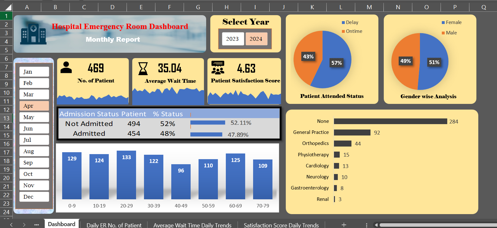

# 🏥 Hospital ER Dashboard – Advanced Excel Project

## 📄 Download the Excel File

📥 [Click here to open the Excel Dashboard »](./HospitalDashboardProject.xlsx)

📊 **An interactive Excel dashboard** analyzing Emergency Room (ER) data to gain insights into patient visits, wait times, and satisfaction levels.

---

## 📌 Project Overview

This Excel dashboard tracks daily ER activity, enabling hospital staff to monitor key performance metrics and enhance operational decisions.

### ✅ Objectives:
- Analyze **daily patient volume**
- Track **average wait times**
- Monitor **patient satisfaction scores**
- Visualize **data trends over time**

---

## 🧮 Data Source

The dataset includes:
- `Date`  
- `No_of_patients`  
- `Average_wait_time`  
- `Satisfaction_score`  
- `Patient_ID`

> Structured to enable dynamic analysis using Excel charts, formulas, and pivot tables.

---

## ✨ Key Features

- 📈 Trend analysis of patient inflow
- ⏱️ Average wait time tracking
- 😊 Correlation of satisfaction with waiting time
- 📊 Easy-to-use and visually clean interface

---

## 💼 Tools Used

- **Microsoft Excel** (Data visualization, charts, formatting)
- **Pivot Tables**
- **Slicers & Filters**
- **Formulas & Conditional Formatting**

---

## 💡 Real-world Impact

This project demonstrates how Excel can be a powerful tool for:
- Quick data exploration
- Operational performance tracking
- Healthcare efficiency improvement

---
## 📷 Dashboard Preview

